# GMM-based-Color-Image-Segmentation

## Environment
* python 3.9.1
* opencv 4.5.1
* scikit-learn 0.24.1

## Install the Packages
```
pip install -r requirements.txt
```

## Train
* 已將訓練過後的模型M1&M2存為**model1**&**model2**於目錄底下，若要重新訓練並儲存模型，執行**train.py**
```
python train.py
```

## Run
* 使用 python interactive window in vscode 執行**main.py**
```
python main.py
```

## GMM model selection: BIC (Bayesian Information Criterion)
* 目標是選擇最佳模型的component數量以及covariance類型，方法為盡量挑選BIC值較低的，但因為兩個模型的BIC值在component數量大於2之後變化不大，為了避免模型過度擬合，所以選擇較為精簡的模型（2 components)。
### Model1(M1): n_component='2', covariance_type='full'
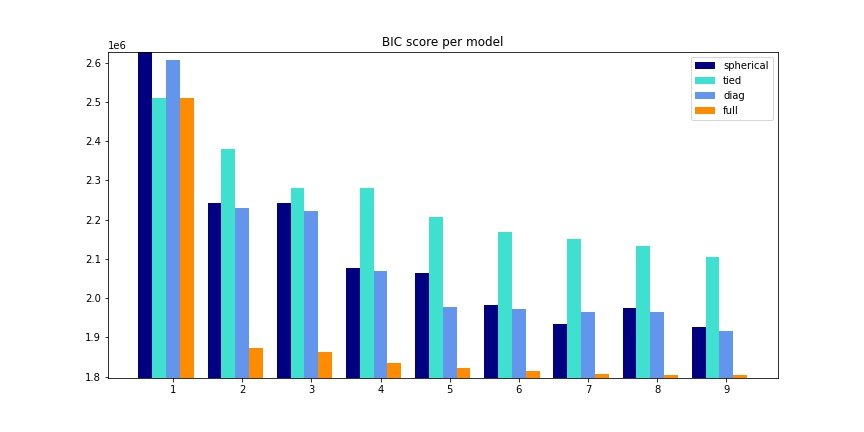
### Model2(M2): n_component='2', covariance_type='full'
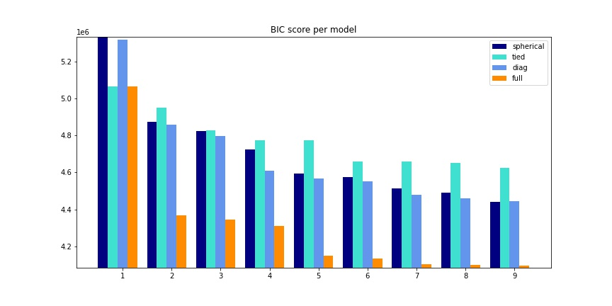
### Segmentation Result with different numbers of n_component (M1)
* original image
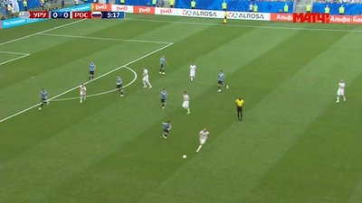
* n_component='2'
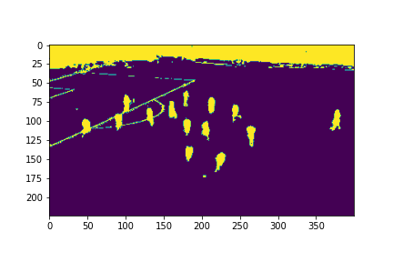
* n_component='9'
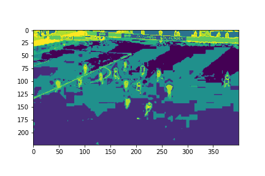

## Results
### Scenario1
Segmentation

Pixel Detection
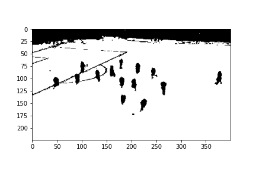
* pixel accuracy = 0.9709
### Scenario2
Segmentation
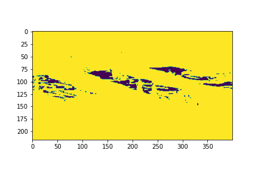
Pixel Detection
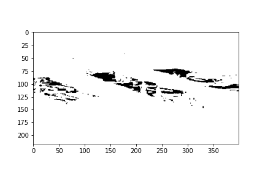
* pixel accuracy = 0.5992
### Scenario3
#### Soccer1
Segmentation
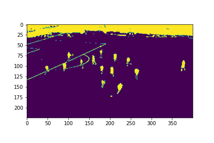
Pixel Detection
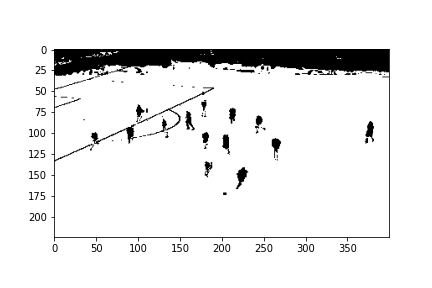
* pixel accuracy = 0.9749
#### Soccer2
Segmentation
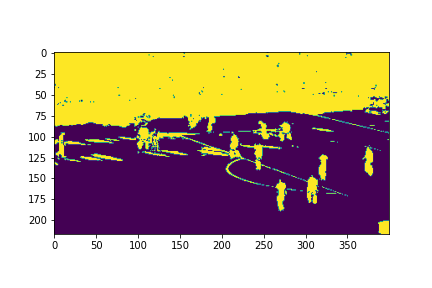
Pixel Detection
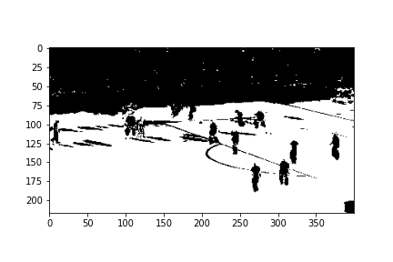
* pixel accuracy = 0.9117

### Performance Evaluation
* Scenario1中模型是以soccer1建構模型並用soccer1做測試，pixel accuracy有0.97
* Scenario2中用soccer1建構的模型測試soccer2，分割效果很差，pixel accuracy只有0.6左右
* Scenario3中使用soccer1以及soccer2一起建構模型，再分別以soccer1和soccer2做測試，分割的效果都很好，pixel accuracy都在0.9以上
